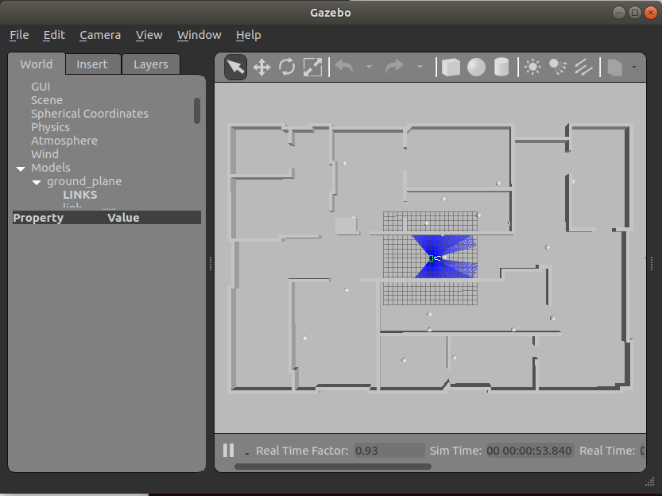

# rb-pro5

The project combines the fields of robotic path planning, computer vision and artificial intelligence, to be implemented as algorithms with the purpose of controlling a robot within a simulated environment; this environment contains marbles where the objective is to map the environment and collect marbles efficiently.



## Getting Started

These instructions will get you a copy of the project up and running on your local machine for development and testing purposes.

### Dependencies

This project is compiled using CMake and built with:

* [OpenCV 3.2](https://opencv.org/) - used for computer vision
* [Gazebo 9](http://gazebosim.org/) - used for simulation environment
* [FuzzyLite](https://fuzzylite.com/) - used for fuzzy control

### Installing

The dependencies can be installed on Linux (Ubuntu 18.04) with the following commands:

```bash
sudo apt-get install libopencv-dev
sudo apt-get install libopencv-contrib-dev
curl -sSL http://get.gazebosim.org | sh
```

If desired, OpenCV 4 can be used, but must be installed [manually](https://www.learnopencv.com/install-opencv-4-on-ubuntu-18-04/) with contrib modules.

**Notice**, if using Visual Studio Code C/C++ extension, the linter might have issues with the Gazebo header files; simply add the following lines to the include path to resolve this issuse:

```
/usr/include/gazebo-9
/usr/include/sdformat-6.2
/usr/include/ignition/math4
/usr/include/ignition/msgs1
```

### Demo

End with an example of getting some data out of the system or using it for a little demo.

## Versioning

We use [SemVer](http://semver.org/) for versioning. For the versions available, see the [releases on this repository](https://github.com/martinandrovich/rb-pro5/releases). Furthermore, this [changelog](https://github.com/martinandrovich/rb-pro5/blob/master/CHANGELOG.md) documents the most relevant changes.

## License

This project is licensed under the MIT License - see the [LICENSE.md](LICENSE.md) file for details.

## Acknowledgments

Thanks to the supervisors at Southern University of Danmark, particulary:

* Thomas F. Iversen
* [Anders L. Christensen](http://home.iscte-iul.pt/~alcen/)
* [Jakob Wilm](https://github.com/jakobwilm)
